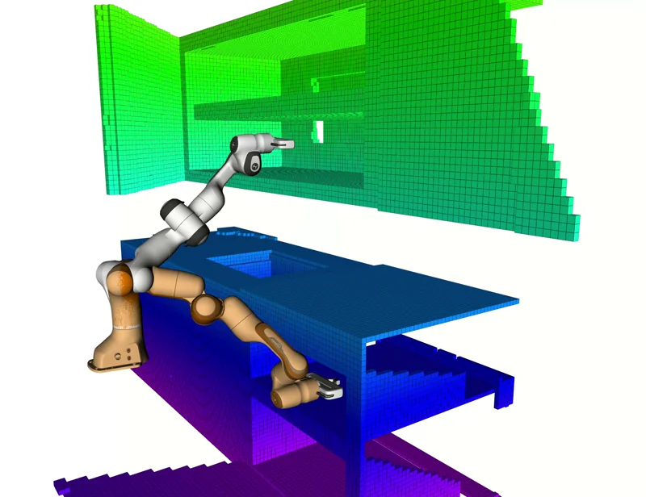
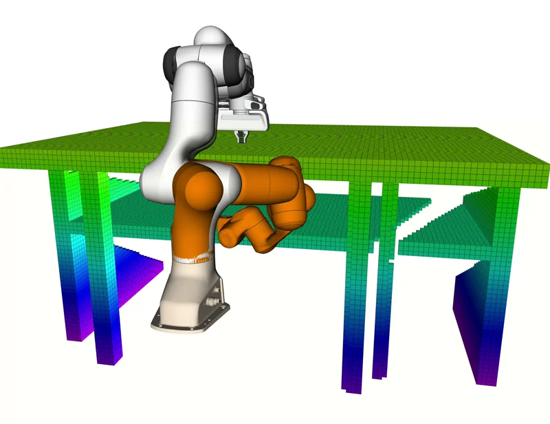
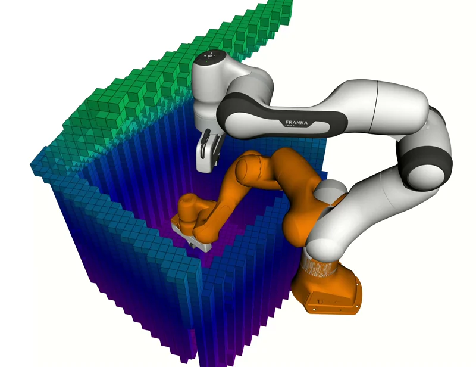

# PCE-ROS: Proximal Cross-Entropy Motion Planning for MoveIt

A MoveIt motion planning plugin implementing **Proximal Cross-Entropy (PCE)** and **Natural Gradient Descent (NGD)** trajectory optimization for robotic manipulators.

## Overview

PCE-ROS provides sampling-based trajectory optimization planners that integrate with MoveIt. The planners leverage distance field representations for efficient collision checking and employ iterative optimization to compute smooth, collision-free trajectories.

### Features

- **Dual Planning Algorithms**: PCE (Proximal Cross-Entropy) and NGD (Natural Gradient Descent) with unified optimization interface
- **MoveIt Integration**: Compatible with standard MoveIt planning pipelines
- **Distance Field Collision Checking**: Gradient-aware obstacle avoidance with configurable safety margins
- **Real-Time Visualization**: Collision geometry and trajectory visualization in RViz
- **Parallel Computation**: OpenMP-accelerated collision cost evaluation
- **Runtime Configuration**: Parameter modification without system restart

### Demonstrations

#### Optimization Process (ROS 1)


#### Motion Planning Execution


#### Benchmark Environments
  

  

## Requirements

### Dependencies

- ROS Noetic (ROS 1) or Jazzy (ROS 2)
- MoveIt
- Eigen3
- OpenMP
- yaml-cpp

### Supported Platforms

Validated on the Franka Emika Panda robot (`panda_moveit_config`). The framework generalizes to any robot with a valid MoveIt configuration.

## Installation

### 1. Clone the Repository

```bash
cd ~/catkin_ws/src
git clone https://github.com/hzyu17/pce_ros.git
```

For ROS 1:
```bash
git checkout master
```

For ROS 2:
```bash
git checkout jazzy
```

### 2. Install Dependencies

```bash
rosdep install --from-paths . --ignore-src -r -y
```

### 3. Build

```bash
cd ~/catkin_ws
catkin build pce_ros
source devel/setup.bash
```

## Usage

### Quick Start

Launch the demonstration environment:

```bash
roslaunch pce_ros pce_standalone.launch
```

This initializes:
- Robot state publisher
- MoveIt move_group with PCE/NGD planners
- RViz with motion planning visualization

### Adding Collision Objects

```bash
rosrun pce_ros test_box.py
```

### Planner Selection

In the RViz MotionPlanning panel:
1. Navigate to the **Context** tab
2. Select the planning pipeline: `pce` or `ngd`
3. Execute planning queries as usual

## Configuration

### Planner Parameters

Parameters are specified in `config/pce_planning.yaml`:

```yaml
pce:
  planning_groups:
    - panda_arm
  
  panda_arm:
    pce_planner:
      num_samples: 3000          # Number of trajectory samples per iteration
      num_iterations: 20         # Maximum optimization iterations
      eta: 0.99                  # Proximal step size coefficient (PCE)
      temperature: 1.5           # Softmax temperature for importance weighting
      convergence_threshold: 0.001
      num_discretization: 50     # Number of trajectory waypoints
      total_time: 5.0            # Trajectory duration [s]
    
    # Collision parameters
    collision_clearance: 0.05    # Safety margin [m]
    collision_threshold: 0.05    # Distance field query threshold [m]
    sigma_obs: 500.0             # Obstacle cost weight
    sphere_overlap_ratio: 0.05   # Collision sphere density factor
```

### Visualization Settings

```yaml
pce:
  visualization:
    enable_collision_spheres: true
    enable_trajectory: true
    enable_distance_field: false
    waypoint_size: 0.02
    line_width: 0.01
    marker_lifetime: 50.0
    trajectory_decimation: 10
    collision_spheres_topic: "/pce/collision_spheres"
    trajectory_topic: "/pce/trajectory"
```

### Runtime Parameter Updates

Parameters are reloaded from YAML at each planning request, enabling modification without restarting the system.

## Package Structure

```
pce_ros/
├── include/
│   ├── pce_planner.h             # PCE planner context
│   ├── pce_planner_manager.h     # PCE plugin manager
│   ├── ngd_planner.h             # NGD planner context
│   ├── ngd_planner_manager.h     # NGD plugin manager
│   ├── pce_optimization_task.h   # Shared optimization interface
│   └── visualizer.h              # RViz visualization utilities
├── src/
│   ├── pce_planner.cpp
│   ├── pce_planner_manager.cpp
│   ├── ngd_planner.cpp
│   ├── ngd_planner_manager.cpp
│   ├── pce_optimization_task.cpp
│   └── visualizer.cpp
├── config/
│   ├── pce_planning.yaml         # Planner configuration
│   └── pce_demo.rviz             # RViz configuration
├── launch/
│   ├── pce_standalone.launch     # Complete demonstration
│   ├── pce_panda.launch          # Panda-specific configuration
│   └── pce_moveit_generic.launch # Generic MoveIt integration
└── scripts/
    └── test_box.py               # Collision object test utility
```

## Algorithm Details

### Proximal Cross-Entropy Method (PCE)

The PCE planner performs trajectory optimization via importance sampling with proximal regularization. Given a trajectory distribution parameterized by mean $\boldsymbol{\mu}$ and covariance $\boldsymbol{\Sigma}$, each iteration proceeds as follows:

1. **Sampling**: Draw $N$ trajectory samples from $\mathcal{N}(\boldsymbol{\mu}, \boldsymbol{\Sigma})$
2. **Evaluation**: Compute collision costs via distance field queries
3. **Reweighting**: Calculate importance weights using softmax transformation
4. **Proximal Update**: Update distribution parameters with KL-divergence constraint controlled by step size $\eta$

The proximal constraint prevents distribution collapse and ensures stable convergence. Higher values of $\eta$ yield more aggressive updates.

### Natural Gradient Descent (NGD)

The NGD planner optimizes trajectories using natural gradient updates that account for the geometry of the parameter space:

1. **Initialization**: Linear interpolation between start and goal configurations
2. **Gradient Computation**: Evaluate collision cost gradient via finite differences
3. **Natural Gradient Update**: Scale gradients by the inverse Fisher information matrix
4. **Iteration**: Repeat until convergence or iteration limit

### Collision Cost Formulation

The collision cost follows the formulation introduced in CHOMP, defined as a function of signed distance $d$:

$$
c(d) = 
\begin{cases}
-d + \frac{\varepsilon}{2} & \text{if } d < 0 \text{ (in collision)} \\[4pt]
\frac{1}{2\varepsilon}(d - \varepsilon)^2 & \text{if } 0 \leq d < \varepsilon \text{ (within safety margin)} \\[4pt]
0 & \text{if } d \geq \varepsilon \text{ (safe)}
\end{cases}
$$

where $\varepsilon$ corresponds to the `collision_clearance` parameter. This formulation provides continuous gradients for optimization while enforcing a safety margin around obstacles.

## Visualization Topics

| Topic | Message Type | Description |
|-------|--------------|-------------|
| `/pce/collision_spheres` | `MarkerArray` | Collision geometry spheres overlaid on robot |
| `/pce/trajectory` | `MarkerArray` | Current trajectory visualization |
| `/pce/distance_field` | `MarkerArray` | Distance field representation |
| `/ngd/collision_spheres` | `MarkerArray` | NGD planner collision geometry |

## License

This project is released under the MIT License.

## Citation

If you use this software in your research, please cite:

```bibtex
Coming soon.
```